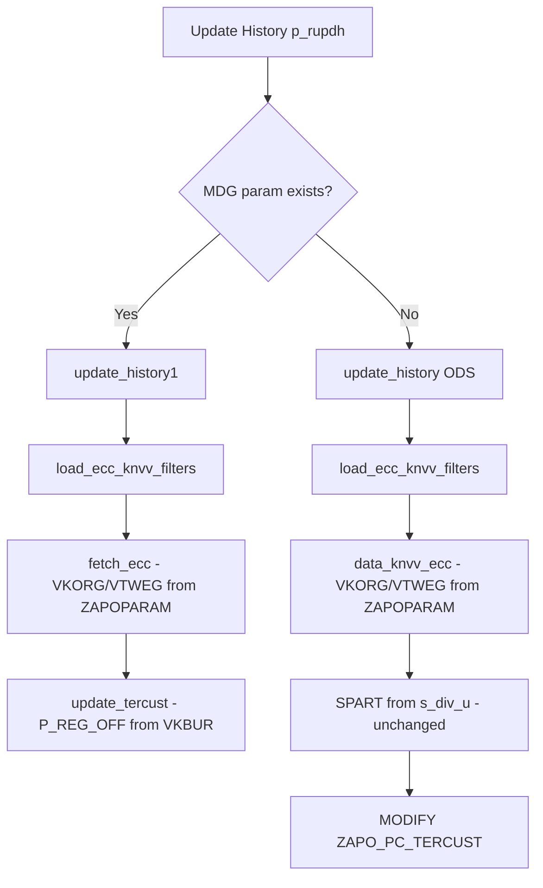

# Functional Specification — Externalize VKORG / VTWEG via ZAPOPARAM

## Document Control

| Item | Detail |
|------|--------|
| **Program** | `ZAPO_REG_MAP_UPLOAD` |
| **Systems** | AD1 (APO), RD2 (ECC) |
| **Change type** | Enhancement — configuration externalization |
| **Table** | `ZAPOPARAM` (existing) |
| **Related docs** | [TS_ECC_KNVV_PARAM.md](./TS_ECC_KNVV_PARAM.md), [TEST_ECC_KNVV_PARAM.md](./TEST_ECC_KNVV_PARAM.md) |
| **Out of scope** | SPART filter logic, RD2 ABAP changes, Excel upload path |

---

## 1. Background

`ZAPO_REG_MAP_UPLOAD` reads customer sales area data from RD2 (`KNVV`) to update `ZAPO_PC_TERCUST`, including `P_REG_OFF` (mapped from `VKBUR`). Today, **VKORG** and **VTWEG** filters are hardcoded in ABAP:

| Field | Current hardcoded rule | Used in |
|-------|------------------------|---------|
| VKORG | Include `1010`, `1020` | `fetch_ecc`, PMR KNVV key matrix |
| VTWEG | Exclude `30`, `80` | `fetch_ecc` |
| SPART | From screen selection (`s_div_u`) | All paths — **unchanged** |

This makes ECC filter changes dependent on ABAP transport and developer intervention.

---

## 2. Business Objective

Allow functional/config teams to maintain **VKORG** and **VTWEG** inclusion and exclusion rules in **ZAPOPARAM** without ABAP changes, while preserving existing **SPART** (division) behaviour driven by the selection screen and business group.

---

## 3. Functional Requirements

### FR-01 — ZAPOPARAM configuration block

New configuration entries shall use:

| Field | Value |
|-------|--------|
| PARAM1 | `DP` |
| PARAM2 | `ZAPO_REG_MAP_UPLOAD` |
| PARAM3 | `ECC_KNVV` |
| PARAM4 | Business group (e.g. `PMR`, `CBC`) or `*` (default) |
| PARAM5 | `VKORG`, `VTWEG`, or `KNVV_KEY` |
| VALUE1 | `I` (include) or `E` (exclude) — not used for `KNVV_KEY` |
| VALUE2 | Single value or comma-separated list (e.g. `1010,1020`) |
| VALUE3 | High value for ranges; for `KNVV_KEY`: VTWEG |
| ACTIVE_FLAG | `X` |

### FR-02 — VKORG / VTWEG filtering

- Program shall read active `ECC_KNVV` entries for the current business group.
- BSG-specific rows (`PARAM4 = <BSG>`) shall override default rows (`PARAM4 = *`) for the same `PARAM5`.
- These rules shall apply to:
  - **Update History (MDG path)** — `fetch_ecc` → `Z_APO_FM_DYN_SELECT_QUERY`
  - **Update History (ODS path)** — `data_knvv_ecc` → `RFC_READ_TABLE` (optional VKORG/VTWEG options)
  - **PMR KNVV lookup matrix** — `KNVV_KEY` rows replace hardcoded VKORG/VTWEG combinations in `update_history`

### FR-03 — SPART remains screen-driven

- SPART shall continue to be derived from:
  - `s_div_u` (populated from business group divisions on **Update History**)
  - Existing tercust / ODS division selections
- **No** ZAPOPARAM `PARAM5 = SPART` entries shall be introduced or consumed.
- `val_shpdiv` shall continue to use PMR division list from upload context (22/23/24 or equivalent screen-driven logic).

### FR-04 — Backward compatibility

If no active `ECC_KNVV` entries exist for a business group, the program shall apply **current hardcoded defaults**:

| Rule | Default |
|------|---------|
| VKORG include | `1010`, `1020` |
| VTWEG exclude | `30`, `80` |
| PMR KNVV_KEY | `(1010,20)`, `(1010,25)`, `(1020,20)`, `(1020,25)` |

### FR-05 — RD2

No functional change on RD2. RD2 continues to execute queries/fetches as requested by AD1 via RFC.

---

## 4. Impacted Process Flows

| Process | Radio / trigger | Impact |
|---------|-----------------|--------|
| Update History (MDG) | `p_rupdh` + MDG param | VKORG/VTWEG from ZAPOPARAM in `fetch_ecc` |
| Update History (ODS) | `p_rupdh` + ODS path | VKORG/VTWEG from ZAPOPARAM in `data_knvv_ecc` (SPART unchanged) |
| Excel upload | `p_rupd` | No change |
| PMR validation | `val_shpdiv` | SPART unchanged; no VKORG/VTWEG change unless extended later |

---

## 5. Configuration Examples

### Default (all business groups)

| PARAM1 | PARAM2 | PARAM3 | PARAM4 | PARAM5 | VALUE1 | VALUE2 | ACTIVE |
|--------|--------|--------|--------|--------|--------|--------|--------|
| DP | ZAPO_REG_MAP_UPLOAD | ECC_KNVV | * | VKORG | I | 1010,1020 | X |
| DP | ZAPO_REG_MAP_UPLOAD | ECC_KNVV | * | VTWEG | E | 30,80 | X |

### PMR-specific KNVV lookup keys

| PARAM1 | PARAM2 | PARAM3 | PARAM4 | PARAM5 | VALUE1 | VALUE2 | VALUE3 | ACTIVE |
|--------|--------|--------|--------|--------|--------|--------|--------|--------|
| DP | ZAPO_REG_MAP_UPLOAD | ECC_KNVV | PMR | KNVV_KEY | | 1010 | 20 | X |
| DP | ZAPO_REG_MAP_UPLOAD | ECC_KNVV | PMR | KNVV_KEY | | 1010 | 25 | X |
| DP | ZAPO_REG_MAP_UPLOAD | ECC_KNVV | PMR | KNVV_KEY | | 1020 | 20 | X |
| DP | ZAPO_REG_MAP_UPLOAD | ECC_KNVV | PMR | KNVV_KEY | | 1020 | 25 | X |

> **KNVV_KEY mapping:** VALUE1 = VKORG, VALUE2 = VTWEG.

---

## 6. Assumptions & Dependencies

- ZAPOPARAM is maintained on **AD1** (program runs on AD1).
- RFC destination to RD2 via `ZAPO_GET_RFC( iv_system = 'ECC' )` remains unchanged.
- `Z_APO_FM_DYN_SELECT_QUERY` on RD2 requires no modification.
- Functional owners own ZAPOPARAM maintenance via existing customizing process.

---

## 7. Risks

| Risk | Mitigation |
|------|------------|
| Misconfigured VKORG/VTWEG → no KNVV data | Fallback defaults; existing empty-data messages |
| Wrong BSG param4 | BSG-specific overrides + default `*` |
| P_REG_OFF not updated | Existing KNVV match logic unchanged; only selection criteria change |

---

## 8. Acceptance Criteria

- [ ] VKORG include/exclude configurable via ZAPOPARAM
- [ ] VTWEG include/exclude configurable via ZAPOPARAM
- [ ] PMR `KNVV_KEY` matrix configurable via ZAPOPARAM
- [ ] SPART logic unchanged (screen-driven `s_div_u`)
- [ ] Fallback defaults when no param entries
- [ ] No RD2 ABAP transport
- [ ] QA test cases TC-01, TC-06, TC-13 passed
- [ ] ZAPOPARAM entries documented and transported to AD1
